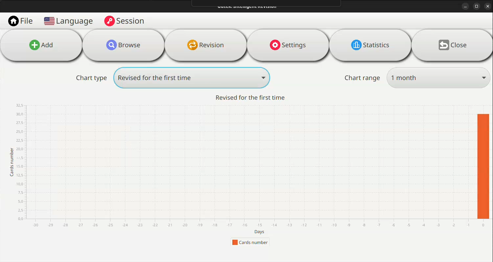
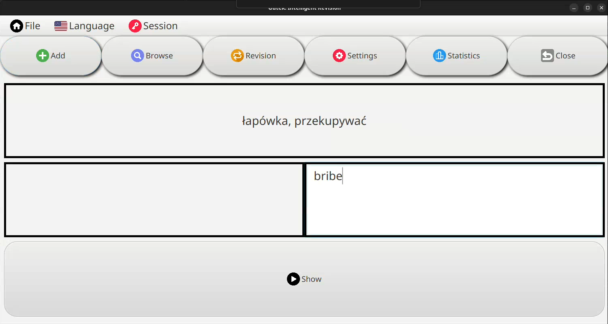

# Introduction

**Gutek** is a user-friendly application designed to make the process of memorization and repetition more effective and enjoyable. Whether you are a language learner, a student preparing for exams, or a professional needing to remember key concepts, Gutek provides a tailored learning experience to meet your needs.

The application combines powerful built-in algorithms and customizable features to help you optimize your learning process. One of its standout features is the two-way revision mechanism, allowing both regular and reverse revision exercises, which makes it ideal for deep and versatile learning.

---

### **What is Gutek?**

Gutek is an intelligent revision framework that allows users to:
- Practice and recall information effectively.
- Use both **regular revision** (recalling translations or answers) and **reverse revision** (recalling original terms or questions from given answers).
- Customize their learning materials and track progress with detailed statistics.

It is designed to simplify and enhance the process of learning and memory retention, making it suitable for various scenarios, including:
- Learning new languages.
- Memorizing definitions, phrases, and concepts.
- Preparing for exams and certifications.
- Rehabilitation and memory analysis for medical purposes.

---

### **Who is it for?**

Gutek is designed for:
- **Students**: To help memorize vocabulary, concepts, or definitions.
- **Teachers**: To create personalized decks and monitor student progress.
- **Professionals**: To maintain knowledge in specialized fields.
- **Medical Practitioners**: To analyze memory and cognitive processes.

Whether you're aiming to learn a new language, prepare for a test, or analyze memory retention, Gutek provides an adaptive platform that evolves with your learning needs.

# Quick Start Guide

Welcome to **Gutek**! Follow these steps to quickly familiarize yourself with the application.

---

### **Note on Language**

This manual is written in English, and all screenshots of the application are presented with the application interface set to English. However, when you change the language within the application, all interface elements, including menus and labels, will adjust to the selected language for a fully localized experience.

---

## 1. **Language Selection**
1. Upon launching the application, the first screen allows you to select the **language** for the application interface.

2. Choose your preferred language from the list and proceed.

---

## 2. **Login or Register**
1. The next screen provides options to **log in** or **register** as a new user.
   - If you already have an account, enter your credentials and click **Log in**.
   - To create a new account, fill in the required details and click **Register**.

---

## 3. **Main View**
After logging in, you will see the **Main View** with **Menu Bar** at the top of the application. 

The Menu Bar contains the following options:

### **File Menu**
- **Decks**: Displays a list of decks belonging to the logged-in user.
- **New**: Provides options to:
   - Create a **new empty deck**.
   - Import words into a **new deck** from a file.
- **Trash**: Shows decks that are currently in the trash.
- **Authors**: Displays the application's authors and the year of creation.
- **Exit**: Closes the application.

### **Languages Menu**
- Allows you to switch the application interface to a different language.

### **Session Menu**
- **Logout**: Logs out the current user and returns to the login screen.

---

## 4. **Decks View**

After clicking on **Decks** in the **File** menu, the application opens the **Decks Management View**. This view displays all decks belonging to the currently logged-in user and provides detailed information and actions for managing each deck.
The **Decks Management View** displays the following properties for each deck:

- **Revision Algorithm**: The algorithm selected for revising the cards in the deck.
- **Deck Name**: The name assigned to the deck.
- **Number of New Cards**: The count of cards marked as "new" in the deck.
- **Total Number of Cards**: The total count of cards present in the deck.
- **Cards by Type**: The number of cards available for different types of repetitions, as supported by the selected revision algorithm.

For each deck in the **Decks Management View**, the following actions can be performed:

1. **Open Deck View**:
   - Click the **Open** button next to a deck to access the **Specific Deck View**.
   - In this view, you can:
      - Start a revision session using the selected algorithm.
      - Edit the deck by adding, modifying, or removing cards.
      - View detailed statistics for the deck.
      - Import additional cards into the deck from a CSV file.

2. **Move to Trash**:
   - Click the **Delete** button to move a deck to the trash.
   - This action is reversible, and the deck can be restored later from the **Trash Menu**.

3. **Export Deck**:
   - Click the **Export** button to save the deck as a CSV file.
   - This is useful for creating backups or sharing decks with other users.

---

## 5. **New View**

In the **New Deck View**, you can add new decks to your collection. To create a deck, follow these steps:

1. Enter the **name** of the deck in the provided text field.
2. Select a **Revision Algorithm** from the available options in the dropdown menu.
3. Choose one of the following methods to create the deck:
   - **Add New**: This button creates an empty deck with the specified name and algorithm.
   - **Import from File**: This button allows you to select a file containing cards. The application will create a new deck with the specified name and algorithm and populate it with the cards from the file.

Once created, the deck will be available in the **Decks Management View**.

---

## 6. **Trash View**

The **Trash View** displays all decks that were previously moved to the trash in the **Decks Management View**. From this view, you can either restore decks to make them available again or permanently delete them from the application.

---

## 7. **Authors View**

The **Authors View** provides information about the creators of the application and the year of its release. This view can be accessed by selecting **Authors** from the **File** menu.

---

## 8. **Selected Deck View**

The **Selected Deck View** is opened by clicking the **Open** button next to a deck in the **Decks Management View**. This view provides a detailed interface for managing and revising the selected deck.

### **Toolbar in Selected Deck View**

At the top of the **Selected Deck View**, a toolbar provides buttons for handling various deck operations:
1. Use **Add** to expand your deck with new cards.
2. Click **Browse** to manage existing cards, including editing or deleting them.
3. Start a **Revision** session to actively review the deck.
4. Adjust deck-specific configurations through **Settings**.
5. Monitor your progress in **Statistics**.
6. Return to the **Decks Management View** at any time by clicking **Close**.

---

### 1. **Add View**:
- Opens a view where you can add new cards to the deck.
- You can specify:
  - **Front**: The word, phrase, or question you want to learn.
  - **Back**: The corresponding answer or translation.
- After filling in the fields, click the **Add** button to add the card to the deck.
- Additionally, there is an option to import cards from a file by clicking the **Import** button.

### 2. **Browse View**:
- Opens the **Browse Cards** view, allowing you to review all cards in the deck.
- In this view, you can:
  - **Edit Cards**: Modify existing terms or answers.
  - **Delete Cards**: Remove unwanted cards from the deck.

### 3. **Revision View**:
- Opens a view to start a revision session for the selected deck.
- Key features of this view include:
  - **Daily New Cards**: Allows you to set the number of new cards to review each day, helping to manage your learning pace.
  - **Available Revision Modes**: Displays all revision modes supported by the selected **Revision Algorithm**, along with:
    - The number of **new cards** planned for today in each mode.
    - The number of **old cards** scheduled for review in each mode.
    - The dedicated button to start the revision session in each mode.

### 4. **Settings View**:
- Opens the **Deck Settings** view, where you can configure the deck's revision algorithm settings.
- Button to save new settings values. The input values are checked to ensure correct algorithm operations.

### 5. **Statistics View**:
- Displays charts that illustrate various statistics for the selected deck.
- Includes both:
    - **Mode-dependent statistics**: Data specific to each revision mode.
    - **Mode-independent statistics**: General deck performance metrics.
- Features include:
    - **Time Range Selection**: Allows users to filter the displayed data by a specific time period.
    - **Chart Type Selection**: Provides options to choose the type of chart for data visualization.

---

## 9. **Revision Session View**

The **Revision Session View** is the core functionality of **Gutek**, where users actively engage in reviewing and learning from their selected deck. The revision mode in this view corresponds directly to the button clicked in the **Revision View** (e.g., Regular or Reverse), ensuring a seamless transition to the desired study session.

### **Workflow in the Revision Session**

1. **Start the Session**:
    - A revision session is initiated by clicking button associated with a specific mode (e.g., Regular or Reverse) in the **Revision View**.
    - Cards scheduled for the day are fetched based on the chosen revision mode and revision algorithm.

2. **Review Cards**:
    - Each card is presented one by one, with the displayed content depending on the selected mode (e.g., front or back of the card).
    - The user attempts to recall the answer or associated content before revealing it.

3. **Rate Your Response**:
    - After revealing the card's content, the user evaluates their familiarity with the card by choosing an option provided by the revision algorithm.
    - This process is repeated for all cards scheduled for the day.

4. **Complete the Session**:
    - Once all cards scheduled for the day are reviewed, a message confirms the completion of the session.
    - The user is then redirected back to the **Revision View**, where they can:
        - Select another revision mode.
        - Analyze the results of the session.

5. **Interrupt and Resume**:
    - A revision session can be interrupted at any time.
    - If interrupted, not all scheduled cards will be reviewed. However, the session can be restarted later, focusing only on the remaining cards that were not completed in the earlier session.

### **Regular Revision - Constant Coefficient Algorithm**

Here is an example of a card in **Regular Revision**, where the front of the card is displayed, and the user must guess the translation.

After guessing, the user is prompted to indicate how well they remembered the word.

### **Reverse Revision - Constant Coefficient Algorithm**

Here is an example of a card in **Reverse Revision**, where the translation is displayed, and the user must guess the original word.

The user inputs their guess in the provided text field.

After revealing the correct word, the user evaluates how well their answer matches the actual word by selecting an appropriate option.

